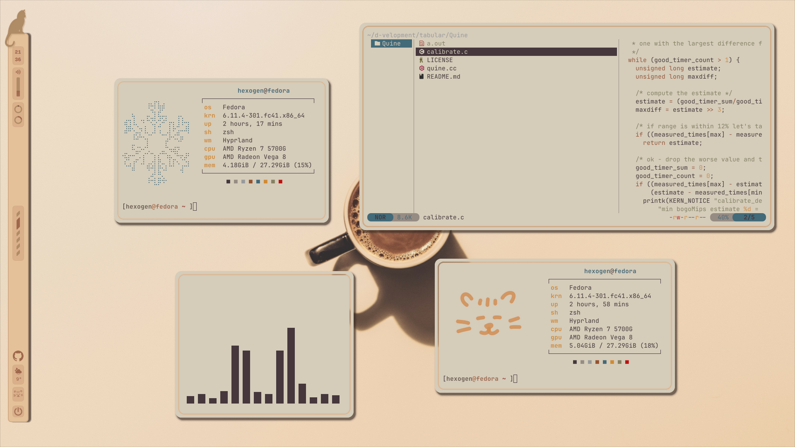
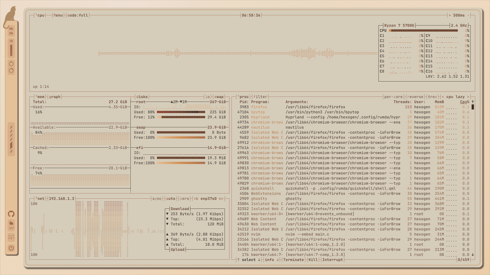
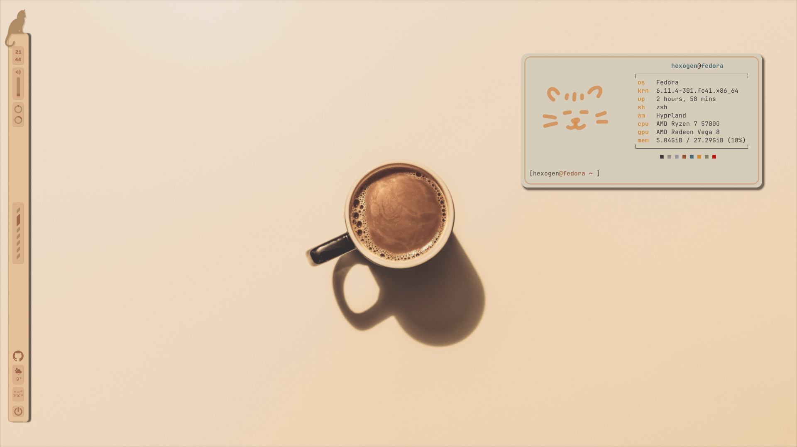
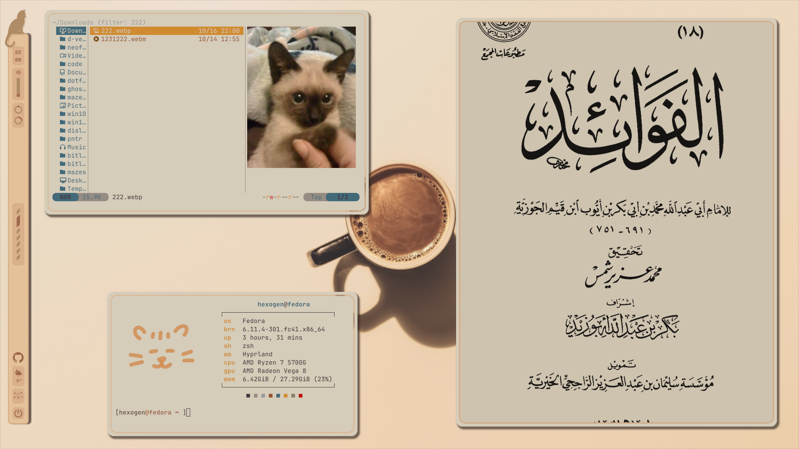
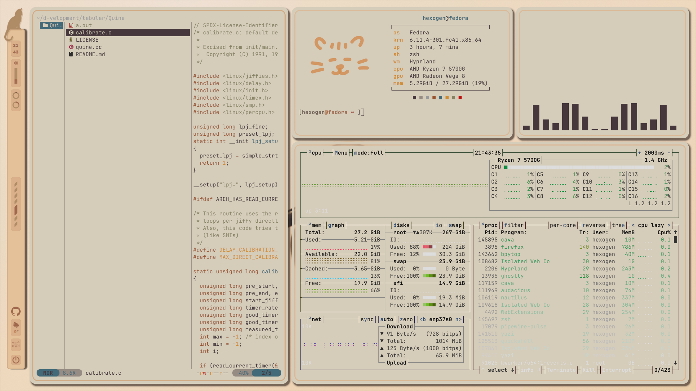
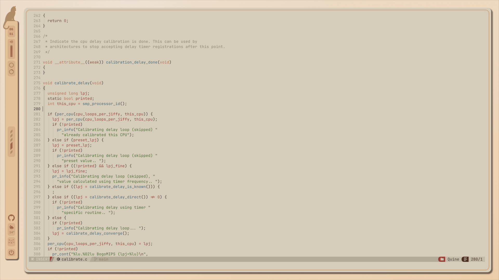
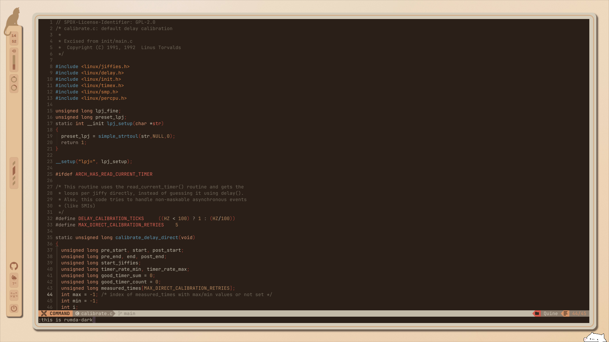
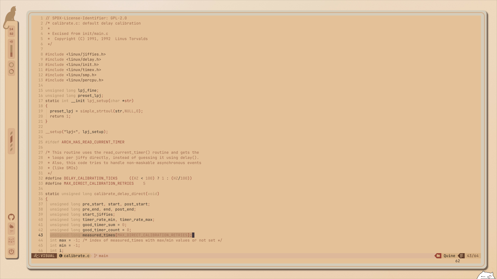
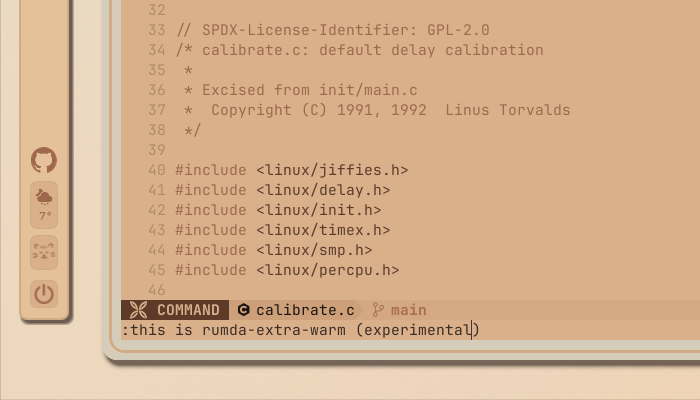
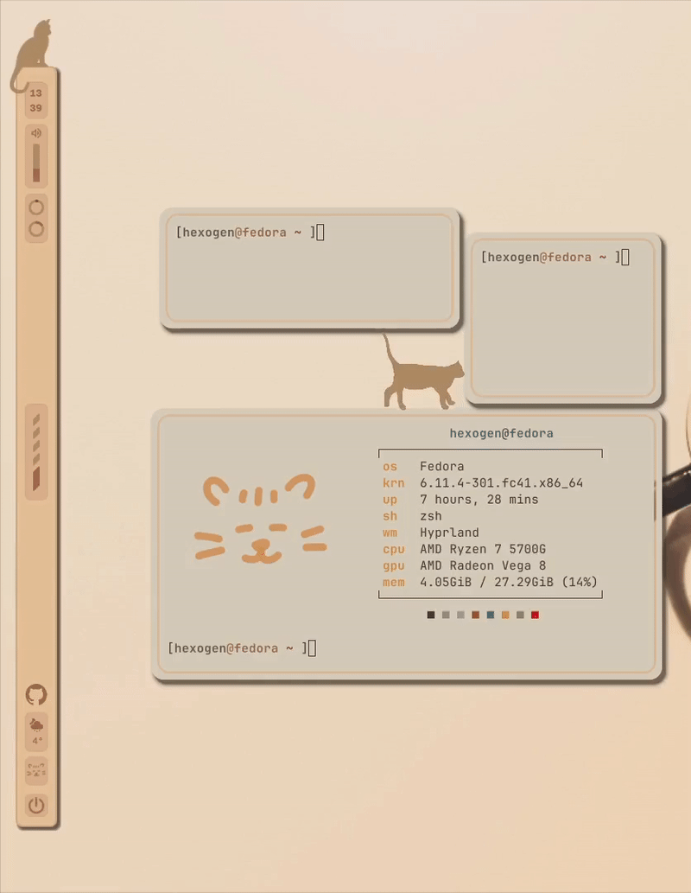

<p align="center">
<a href="https://git.io/typing-svg"></a>
<br/>
        
        
        
         <br>


```
      ／l、           
    （ﾟ､ ｡ ７               a warmer, more cozy desktop..                   へ      ╱|、
      l  ~ヽ                                                            ૮ -  ՛)   (`  -7
      じしf_,)ノ                                                     乀 (ˍ, ل ل     じしˍ,)ノ
```
</p>


> [!WARNING]
> This is a **WIP** that *might* not work for you out of the box. I am currently cleaning it up and adding better features. Stay tuned!
---


> **things I'm working on:** themes for: file-manager, browser, discord + more widgets, and of course: [Rumda, the cat.](#rumda-the-cat)
> also, the [theme switcher](#theme-switcher)

> **Note:** theme switch is *still* under construction

> **Note:** the bar and widgets config can be changed through the qml files in /common/quickshell/light/config/
---

>  Big thanks to xfcasio, as this is a modified version of his rice, [Amadeus](https://github.com/xfcasio/amadeus/). 

---


## Gallery















---


## Rumda color-scheme for nvim:
the colorscheme for the editor could be found at /.config/rumda/nvim/lua/themes/


### rumda-light



---


### experimental themes


**the theme: rumda-light is more reliable**, the dark/warm/extra-warm ones aren't refined yet.. but enjoy, anyway :)


---


### rumda-dark



### rumda-warm



### rumda-extra-warm



---

### Rumda the cat

Rumda the cat should be the main feature in these dotfiles. Sadly however, I am stuck with many side-projects, so I can't fully finish this widget yet. Here, Rumda is stuck too:



The cat widget ~might~ will (insha'allah) be able to get out soon. We'll see! 
Currently, the cat on top of the bar just does a ~goofy~ jump-out animation when you click it. If you click on its resting spot again, it comes back.

PS: the cat face at the bottom of the bar is an internet widget. if it's smiling, you're connected :)


### theme switcher
I kick off the cat for a little fun

