<p align="center">
<a href="https://git.io/typing-svg"></a>
<br/>
        
        
        
         <br>


</p>


> [!IMPORTANT]
> if you would like to try it
> see [installation](#installation-fedora).
>
> **for config and some issues**, [check this](#config)
> 
> you can also check: [Gallery](#gallery)  -  [Keybinds](#keybinds) - [Misc](#misc)
>
> Built over the goat'ed Amadeus: https://github.com/xfcasio/amadeus
>
> Note: I use Fedora. The rice could work on other distros fine, but parts of it will not be up-to-date with their package versions. You can try to contact me for help in that case.


## Gallery


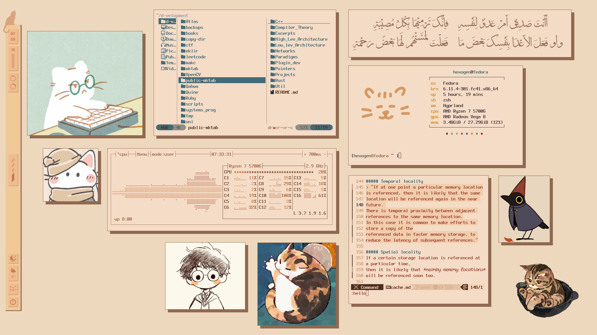
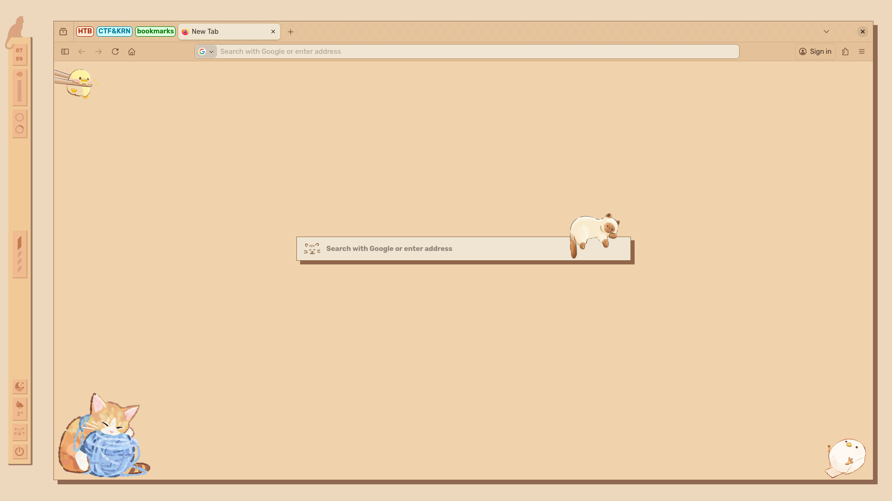


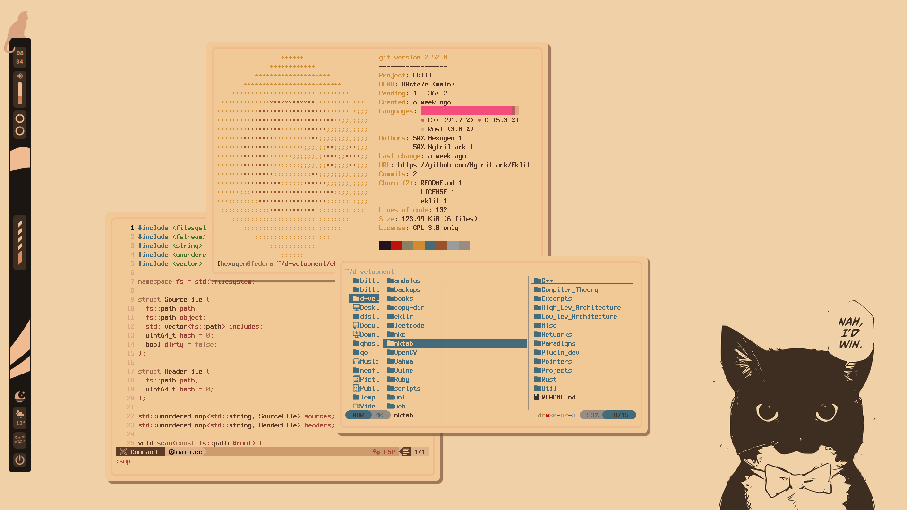

| 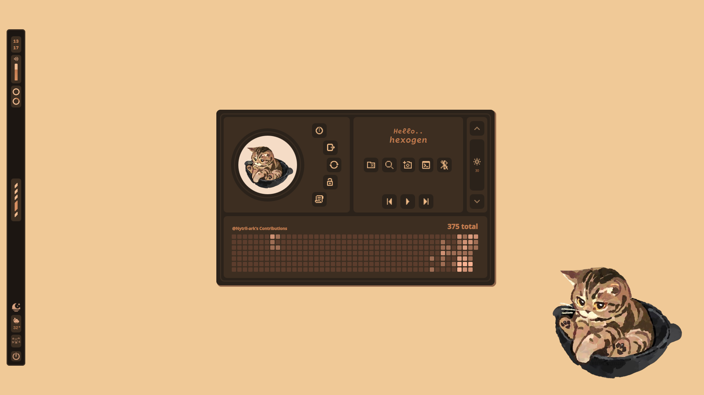  | 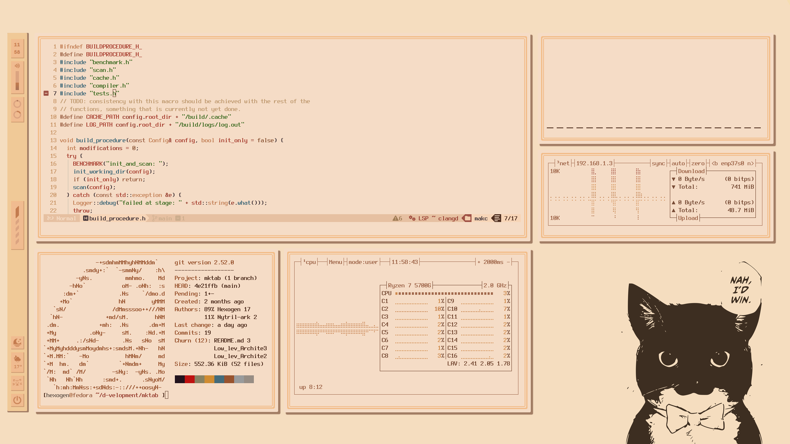    |
| -------------------------------- | ------------------------------- |

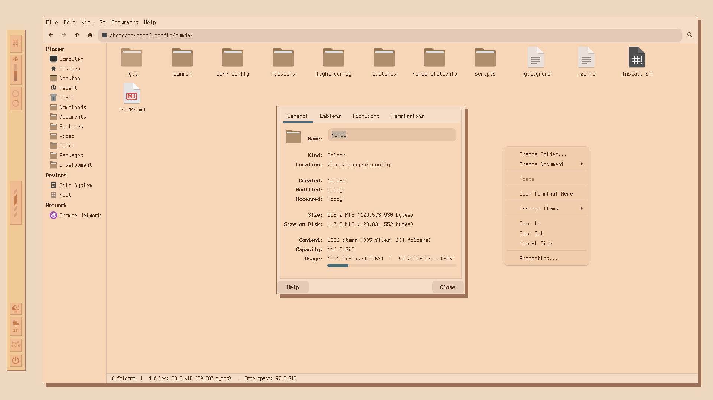
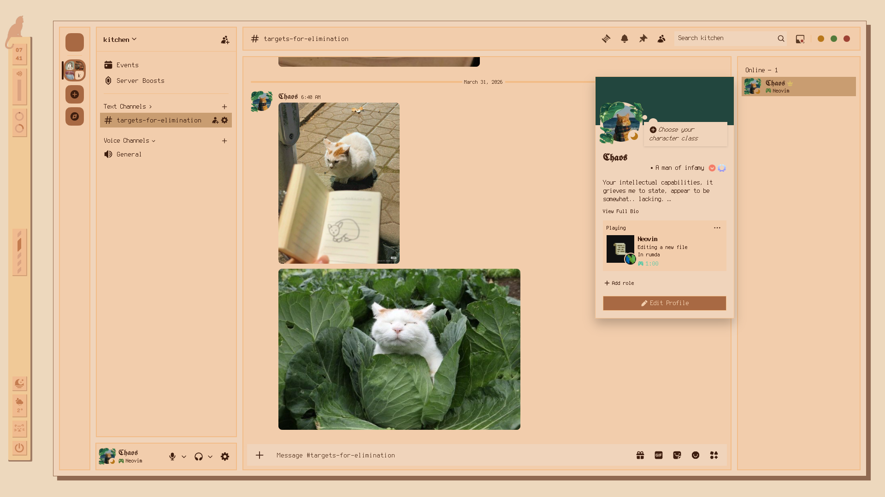 
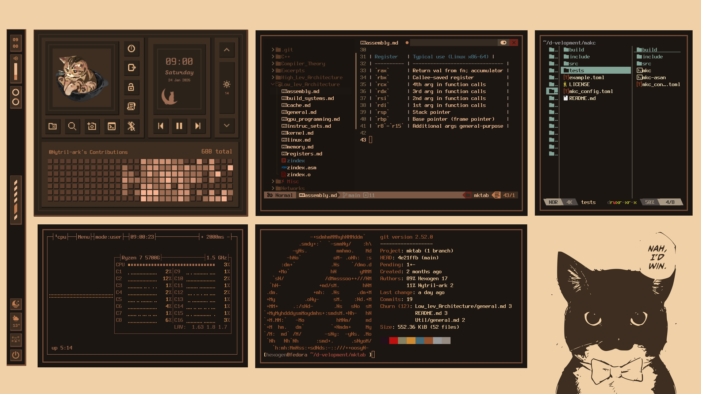


### old pistachio theme available in installer

  <details>
  <summary>Rumda-pistachio</summary>

  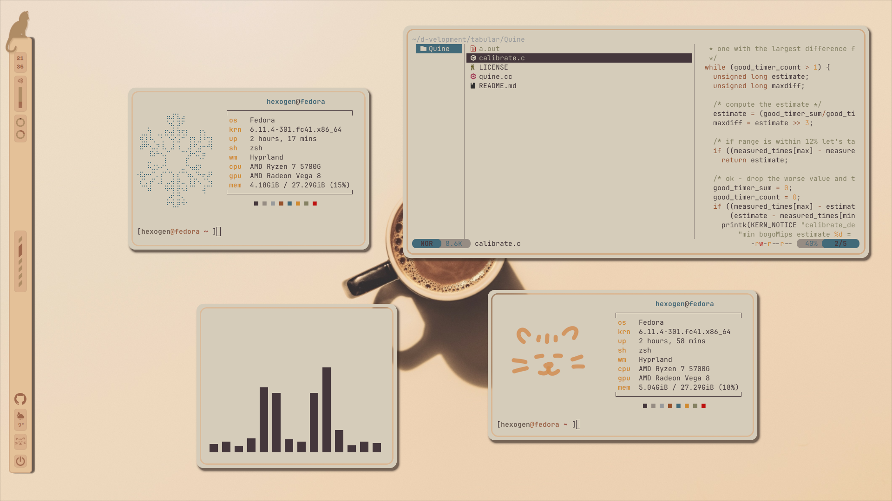
  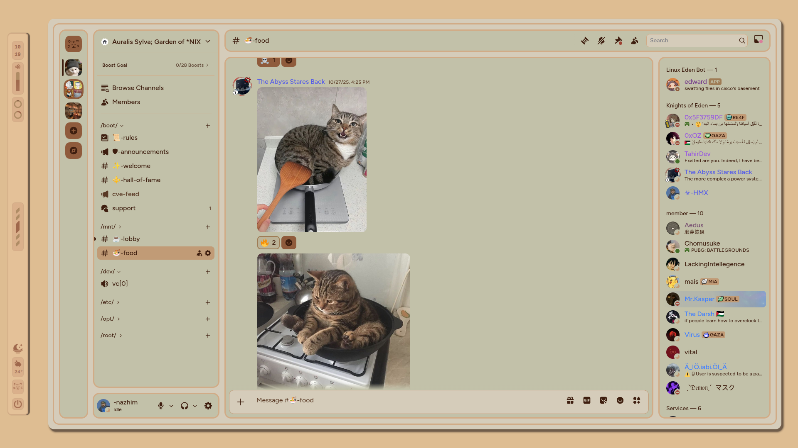  
  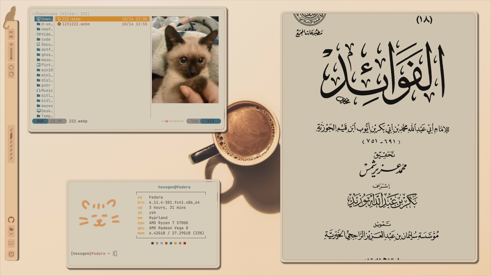  
  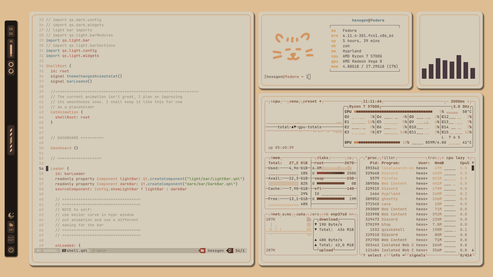
 </details>


---


## Installation (Fedora)

> [!NOTE]
> If you're on Fedora, you could let my installer get all the packages automatically.
>


> [!CAUTION]
> \[don't delete or change the position of the repo after using the following command\]
>
> Use this one-liner to clone and install:
>

```bash
cd ~/.config && git clone --depth=1 https://github.com/Nytril-ark/rumda && cd rumda && chmod +x install.sh && ./install.sh
```
and you'll be done!


---
---
---


## For other distros

> In case you're on a different distro, or you want to do it manually, or in case a package fails to install, here are the names:


```
hyprland quickshell rofi alacritty awww thunar neofetch swappy grim zathura yazi jetbrains-mono-fonts mako hyprpicker neovim \
ghostty  nautilus  btop bpytop obs-studio slurp xdg-desktop-portal-hyprland wl-clipboard git\
 jq lz4-devel lua python3 brightnessctl playerctl wpctl pipewire wireplumber
```

Recommended:
```
Firefox toolbar theme by Looma: https://addons.mozilla.org/en-US/firefox/addon/rumda/ 
Nvchad (cleanly manage your themes)
borders-plus-plus hyprland plugin (for the double borders)
And lastly, something to setup the custom discord theme.
```

> you can also edit the install.sh file to only install replace the configs you want, by making some vars at the top = false.
> and you can edit it to install the old pistachio theme, though it's unmaintained, so I don't recommend that.


## Keybinds

**Note:** to switch between different 'flavours' hit the internet module on the bar (cat face above the power button)

| **Keys**                     | **Description**             |
| ---------------------------- | --------------------------- |
| `$mainMod + W`               | Open Firefox                |
| `$mainMod + Enter`           | Open terminal               |
| `$mainMod + R`               | Launch app menu             |
| `$mainMod + F`               | Open file manager           |
| `$mainMod + S`               | Full screen screenshot      |
| `$mainMod + G`               | Toggle compact look         |
| `$mainMod + shift + S`       | screenshot a region         |
| `$mainMod + alt + shift S`   | screenshot region + edit    |
| `$mainMod + C`               | Close focused window        |
| `$mainMod + M`               | Exit Hyprland               |
| `$mainMod + V`               | Toggle floating mode        |
| `$mainMod + P`               | Toggle pseudo layout        |
| `$mainMod + L`               | Lock screen                 |
| `$mainMod + Shift + Return`  | Open Ghostty terminal       |
| `$mainMod + shift + T`       | OCR into clipboard          |
| `$mainMod + Shift + Alt + Q` | Force kill window           |
| `$mainMod + Alt + Arrows`    | Move focus between windows  |
| `$mainMod + Shift + [0–9]`   | Move window to workspace    |
| `$mainMod + Scroll / Arrows` | Switch workspace scroll     |
| `$mainMod + up/down arrows`  | Move or resize window       |
| `XF86Audio / F-keys`         | Volume and media control    |
| `$mainMod + TAB`             | Toggle Rumda dashboard      |
| `$mainMod + ;`               | Shrink split ratio          |
| `$mainMod + ' `              | Grow split ratio            |
| `$mainMod + Alt + Space`     | Float/tile                  |
| `$mainMod + D`               | Maximize window             |
| `$mainMod + Shift + C`       | Color picker                |
| `Ctrl + Alt + R`             | Start OBS recording         |
| `$mainMod + Q`               | rofi + random arabic poetry |
|**note:**                     | mainmod =      `Super`      |


---
## misc


### themeswitch, dashboard and lockscreen


---
## config


> [!NOTE]
> Configuring your own changes in the rice & possible issues

<details>
<summary>Things that may cause issues</summary>

        
> If something isn't working, make sure you have installed quickshell, hyprland, awww, and other dependencies correctly. it could also be that you're missing one of the recommended dependencies [here](#for-other-distros).
>
> 
>
> you can go to rumda/common/quickshell/shared/Common.qml to change things like dashboard pfp, github account name (for the dashboard), as well as default bar theme. 
>
>MORE IMPORTANTLY if your dashboard has weird sizes because of the difference between my screen size and yours, you can tweak the dashboardWidth / height values in that same Common.qml file.
>
> 
</details>


<details>
<summary>Basic configuration</summary>

> you can go to rumda/common/quickshell/light/config/Colors.qml to edit colors, same goes for .../dark/config/Color.qml
> 
> I don't recommend messing with them *too much* though
>
</details>


<details>
<summary>configuring further</summary>

> it would be better to make changes in the rumda dir itself, as the files at .config are just symlinked to there.
> you can then use any of the theme scripts in rumda/scripts/ to push your updates into place, in case they didn't
> get pushed there on their own. Please open an issue here if you need further guidance.
</details>


---

### Rumda the cat

Rumda the cat should be the main feature in these dotfiles. Sadly however, I am stuck with many side-projects, so I can't fully finish this widget yet. Here, Rumda is stuck too:

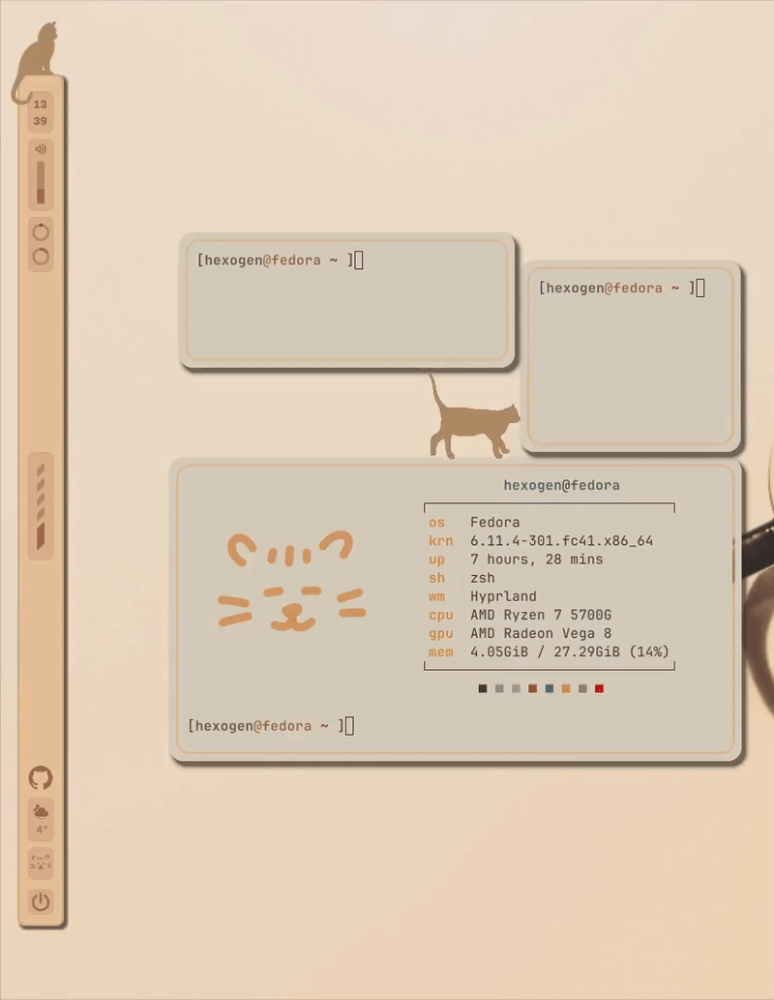


The cat widget ~might~ will (insha'allah) be able to get out soon. We'll see! 

PS: the cat face at the bottom of the bar is an internet widget. If it's smiling, you're connected :)

