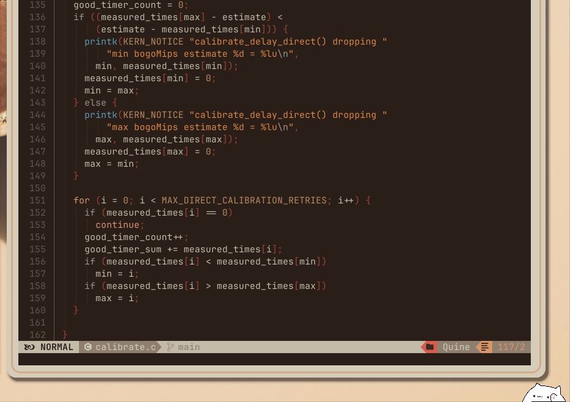

<p align="center">
<a href="https://git.io/typing-svg"></a>
<br/>
        
        
        
         <br>


```
      ／l、           
    （ﾟ､ ｡ ７                        a warmer, more cozy desktop..      へ      ╱|、
      l  ~ヽ                                                        ૮ -  ՛)   (`  -7
      じしf_,)ノ                                                 乀 (ˍ, ل ل     じしˍ,)ノ
```
</p>


> [!IMPORTANT]
> if you would like to try it
> see [installation](#installation).
>
> 
> you can also check: [Gallery](#gallery)  -  [Keybinds](#keybinds) - [Misc](#misc)
>

---

>  Big thanks to xfcasio, as this was based on his rice, [Amadeus](https://github.com/xfcasio/amadeus/). 
>
> if you wanna [make your own changes](#config)
>


---


## Gallery


|  |  |
| -------------------------------- | ------------------------------- |


### old pistachio theme available in installer
<details>
  <summary>Rumda-pistachio</summary>

  

    
  

    
  

</details>


---


## Installation


> [!NOTE]
> the installation assumes you have all the dependencies
> 
> you could eyeball what dependencies to install if you want.
> 
> If you don't want to eyeball them, check the following:
>

<details>
<summary>All dependencies</summary>
        
Basic dependencies
```
hyprland
quickshell
rofi
alacritty
swww 
neofetch 
swappy slurp grim 
zathura 
yazi 
neovim
Cartograph-CF font
```

Full dependencies: 
```
hyprland quickshell rofi alacritty swww thunar neofetch swappy grim zathura yazi jetbrains-mono-fonts mako hyprpicker neovim \
ghostty  nautilus  btop bpytop obs-studio xdg-desktop-portal-hyprland wl-clipboard git\
 jq lz4-devel lua python3 brightnessctl playerctl wpctl pipewire wireplumber Cartograph-CF
```

Recommended:
```
borders-plus-plus hyprland plugin (for the double borders)
Nvchad (cleanly manage your themes)
And lastly, something to setup the custom discord theme.
```

</details>

---


### install.sh
> [!CAUTION]
> please follow these steps:
> - make sure you have installed quickshell, hyprland, etc
> - make **sure** the repo is at _~/.config/rumda_
> 
> You can use this one-liner to clone it and install:


```bash
cd ~/.config && git clone https://github.com/Nytril-ark/rumda && cd rumda && chmod +x install.sh && ./install.sh
```
#### note that the installer will let you install either the old pistachio theme or the new beige theme (which is the default)
> you can also edit the install.sh file to only install what you want by making some vars at the top = false.


## Keybinds

| **Keys**                     | **Description**            |
| ---------------------------- | -------------------------- |
| `$mainMod + W`               | Open Firefox               |
| `$mainMod + Enter`           | Open terminal              |
| `$mainMod + R`               | Launch app menu            |
| `$mainMod + F`               | Open file manager          |
| `$mainMod + S`               | Full screen screenshot     |
| `$mainMod + shift + S`       | screenshot a region        |
| `$mainMod + alt + shift S`   | screenshot region + edit   |
| `$mainMod + C`               | Close focused window       |
| `$mainMod + M`               | Exit Hyprland              |
| `$mainMod + V`               | Toggle floating mode       |
| `$mainMod + P`               | Toggle pseudo layout       |
| `$mainMod + L`               | Lock screen                |
| `$mainMod + Shift + Return`  | Open Ghostty terminal      |
| `$mainMod + Shift + Alt + Q` | Force kill window          |
| `$mainMod + Alt + Arrows`    | Move focus between windows |
| `$mainMod + Shift + [0–9]`   | Move window to workspace   |
| `$mainMod + Scroll / Arrows` | Switch workspace scroll    |
| `$mainMod + up/down arrows`  | Move or resize window      |
| `XF86Audio / F-keys`         | Volume and media control   |
| `$mainMod + TAB`             | Toggle Rumda dashboard     |
| `$mainMod + ;`               | Shrink split ratio         |
| `$mainMod + ' `              | Grow split ratio           |
| `$mainMod + Alt + Space`     | Float/tile                 |
| `$mainMod + D`               | Maximize window            |
| `$mainMod + Shift + C`       | Color picker               |
| `Ctrl + Alt + R`             | Start OBS recording        |
|**note:**                     | mainmod =      `Super`     |


---
## misc


### theme switcher
I kick off the cat for a little fun


---
## config


> [!NOTE]
> Configuring your own changes in the rice

<details>
<summary>Basic configuration</summary>


> to change things like dashboard pfp, github account name (for the dashboard too), you can
> 
> go to rumda/common/quickshell/shared/Common.qml
>
> you can go to rumda/common/quickshell/light/config/ to edit things like colors, same goes for the dark/config/
> 
> other things are set up there in Config.qml, but I don't recommend messing with them *too much*
>

</details>

<details>
<summary>configuring further</summary>


> if you don't want updates, you can mostly directly configure any of the files at ~/.config/ on your pc
> 
> if you do want updates however, it would be better to make the changes in the rumda dir itself
> 
> then migrate them with the install script, and pull from the repo for updates/features.
>
> note that ~/.config/hypr/ is symlinked to the ones in the rumda dir whenever you use the theme switcher
> 
> so applying changes there would be better
>

</details>


#### Color-scheme for nvim:


##### rumda light


#### experimental themes:
haven't refined those yet..
<details>
<summary>dark, warm, extra-warm</summary>



</details>

---

### Rumda the cat

Rumda the cat should be the main feature in these dotfiles. Sadly however, I am stuck with many side-projects, so I can't fully finish this widget yet. Here, Rumda is stuck too:


The cat widget ~might~ will (insha'allah) be able to get out soon. We'll see! 

PS: the cat face at the bottom of the bar is an internet widget. If it's smiling, you're connected :)

