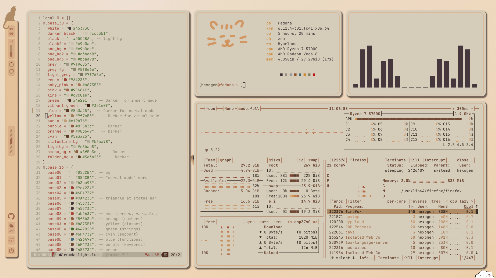
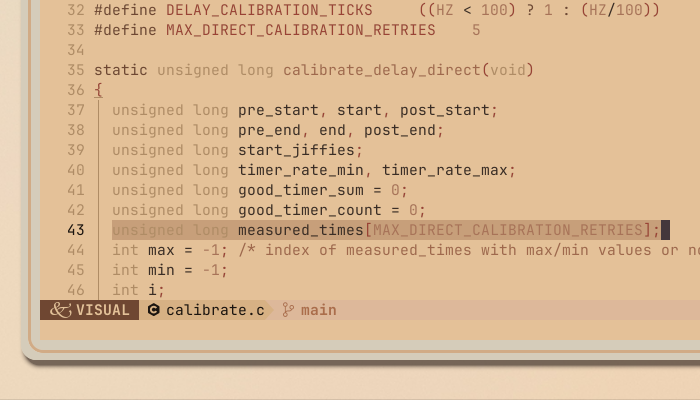

<p align="center">
<a href="https://git.io/typing-svg"></a>
<br/>
        
        
        
         <br>


```
      ／l、           
    （ﾟ､ ｡ ７               a warmer, more cozy desktop..                   へ      ╱|、
      l  ~ヽ                                                            ૮ -  ՛)   (`  -7
      じしf_,)ノ                                                     乀 (ˍ, ل ل     じしˍ,)ノ
```
</p>


> [!IMPORTANT]
> This is a *wip* and I'm adding things to it every day, but if you would like to try it
> see [installation](#installation).
>
> you can also check: [Gallery](#gallery)  -  [Keybinds](#keybinds) - [Misc](#misc)
>
---

>  Big thanks to xfcasio, as this is a modified version of his rice, [Amadeus](https://github.com/xfcasio/amadeus/). 
>
> **things I haven't finished:** themes for: Thunar (file manager), browser, discord + more widgets


---


## Gallery


|  |  |
| ------------------------------ | ------------------------- |
|       |  |


---


## Installation


> [!NOTE]
> the installation assumes you have all the dependencies 
> you could skip some of them if you don't want them
> but this is what I use:
>
#### dependencies:
this is a wip as I am trying the install script, in the rare case that you happen to be reading this while I'm testing, please
dont install yet.

You can run the dots if you just have basics like hyprland, quickshell, rofi, and nvim. If you want a complete list 
of dependencies, expand the bits below:

<details>
<summary>All dependencies</summary>

Use your fav package manager to install those:
```
hyprland quickshell rofi alacritty zathura grim brightnessctl playerctl wpctl pipewire wireplumber \
thunar nautilus neovim btop bpytop papirus-icon-theme yazi jetbrains-mono-fonts mako hyprpicker obs-studio \
xdg-desktop-portal-hyprland wl-clipboard git jq lua python3 swww ghostty
```
If using dnf, do this: 
```
sudo dnf install hyprland rofi alacritty zathura grim brightnessctl playerctl wpctl pipewire wireplumber \
thunar nautilus neovim btop bpytop papirus-icon-theme jetbrains-mono-fonts mako hyprpicker obs-studio \
xdg-desktop-portal-hyprland wl-clipboard git jq lua python3 --skip-unavailable 
```

then those
```
sudo dnf copr enable errornointernet/quickshell 
sudo dnf install quickshell
```
```
sudo dnf copr enable scottames/ghostty
sudo dnf install ghostty
```
```
dnf copr enable lihaohong/yazi
dnf install yazi
```
Note to self: add swww

</details>


> [!CAUTION]
> please follow these steps carefully:
> - make sure you have installed quickshell, hyprland, etc
> - make sure the repo is at ~/.config/rumda
> - lastly, I recommend installing NvChad for nvim
> You can use this one-liner to clone it and install:


```bash
cd ~/.config && git clone https://github.com/Nytril-ark/rumda && cd rumda && ./install.sh
```

or do them one by one..
```bash
cd ~/.config 
git clone https://github.com/Nytril-ark/rumda 
cd rumda 
./install.sh
```


## Keybinds

| **Keys**                     | **Description**            |
| ---------------------------- | -------------------------- |
| `$mainMod + W`               | Open Firefox               |
| `$mainMod + Enter`           | Open terminal              |
| `$mainMod + R`               | Launch app menu            |
| `$mainMod + F`               | Open file manager          |
| `$mainMod + S`               | Take screenshot            |
| `$mainMod + C`               | Close focused window       |
| `$mainMod + M`               | Exit Hyprland              |
| `$mainMod + V`               | Toggle floating mode       |
| `$mainMod + P`               | Toggle pseudo layout       |
| `$mainMod + L`               | Lock screen                |
| `$mainMod + Shift + Return`  | Open Ghostty terminal      |
| `$mainMod + Shift + Alt + Q` | Force kill window          |
| `$mainMod + Alt + Arrows`    | Move focus between windows |
| `$mainMod + Shift + [0–9]`   | Move window to workspace   |
| `$mainMod + Scroll / Arrows` | Switch workspace scroll    |
| `$mainMod + up/down arrows`  | Move or resize window      |
| `XF86Audio / F-keys`         | Volume and media control   |
| `$mainMod + TAB`             | Toggle Rumda dashboard (WIP) |
| `$mainMod + ;`               | Shrink split ratio         |
| `$mainMod + ' `              | Grow split ratio           |
| `$mainMod + Alt + Space`     | Float/tile                 |
| `$mainMod + D`               | Maximize window            |
| `$mainMod + Shift + C`       | Color picker               |
| `Ctrl + Alt + R`             | Start OBS recording        |
|**note:**                     | mainmod =      `Super`     |


---
## misc


### theme switcher
I kick off the cat for a little fun


---


#### Color-scheme for nvim:


##### rumda light


#### experimental themes:
haven't refined those yet..
<details>
<summary>dark, warm, extra-warm</summary>



</details>

---

### Rumda the cat

Rumda the cat should be the main feature in these dotfiles. Sadly however, I am stuck with many side-projects, so I can't fully finish this widget yet. Here, Rumda is stuck too:


The cat widget ~might~ will (insha'allah) be able to get out soon. We'll see! 
Currently, the cat on top of the bar just does a ~goofy~ jump-out animation when you click it. If you click on its resting spot again, it comes back.

PS: the cat face at the bottom of the bar is an internet widget. if it's smiling, you're connected :)

