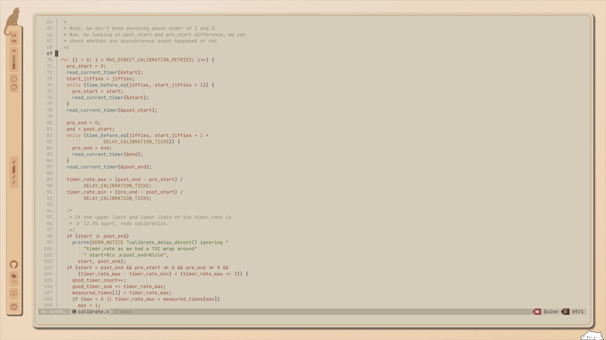
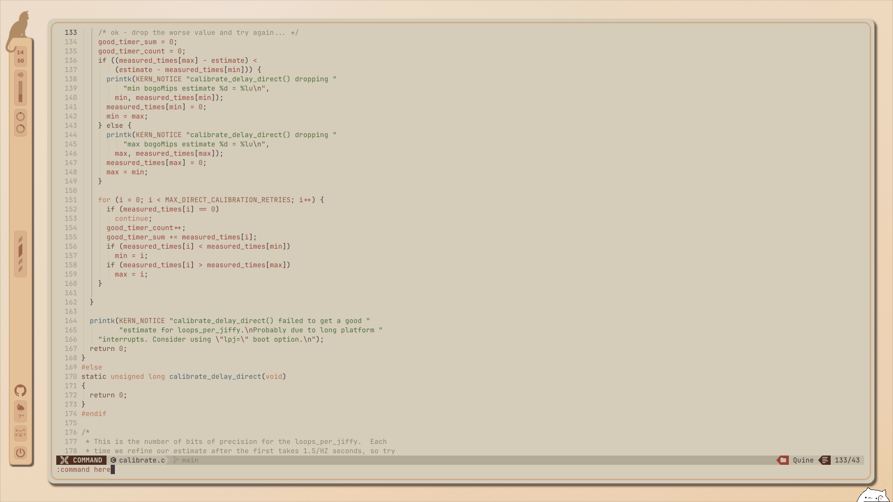

<p align="center">
<a href="https://git.io/typing-svg"></a>
<br/>
        
        
        
         <br>
          
```
   ／l、               
 （ﾟ､ ｡ ７                      a warmer, more cozy desktop..   
   l  ~ヽ                                                                     (\__/)
   じしf_,)ノ                                                                 (='.'=) 
```
</p>


### disclaimer:
This is a WIP that *might* not work for you out of the box. I plan on cleaning it up **very** soon, and I'll add better features. Stay tuned!


Big thanks to xfcasio, as this is a modified version of his rice, [Amadeus](https://github.com/xfcasio/amadeus/). 

## Gallery


---


## Rumda color-scheme for nvim:
the colorscheme for the editor could be found at /.config/rumda/nvim/lua/themes/

### rumda-light
|  |  |  |


---


### experimental themes
**the themes: rumda-light color-scheme is more reliable**, the dark/warm/extra-warm ones aren't refined yet.. but enjoy, anyway :)


---


### rumda-warm

### rumda-extra-warm

### rumda-dark


